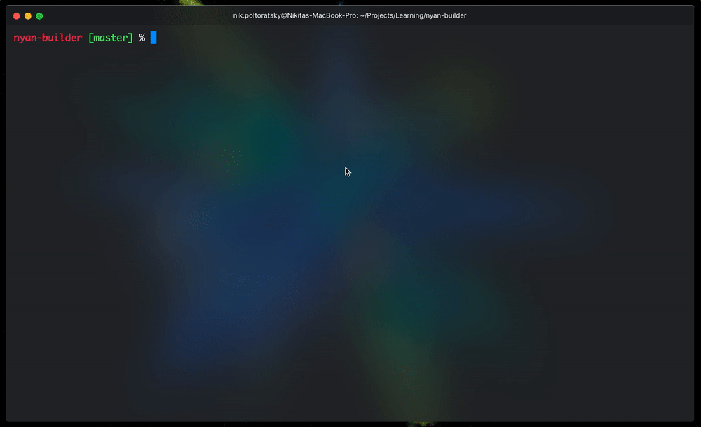

# Angular CLI Nyan Builder 👇

## Installation

- `npm i nyan-builder`
- Register builder itself. Just :
  - Browser: `"builder": "nyan-builder:browser"`
  - Dev Server: `"builder": "nyan-builder:dev-server"`
  - Karma: `"builder": "nyan-builder:karma"`
  - Server: `"builder": "nyan-builder:server"`
  
  
## How can I support the developer?

- Create pull requests, submit bugs, suggest new features or documentation updates 🔧
- Star my [GitHub](http://github.com/tibing/) repos ⭐️
- Read me on [Medium](https://medium.com/@nik.poltoratsky) and [Dev.to](https://dev.to/nikpoltoratsky)
- Follow me on [Twitter](https://twitter.com/NikPoltoratsky) 🐾
