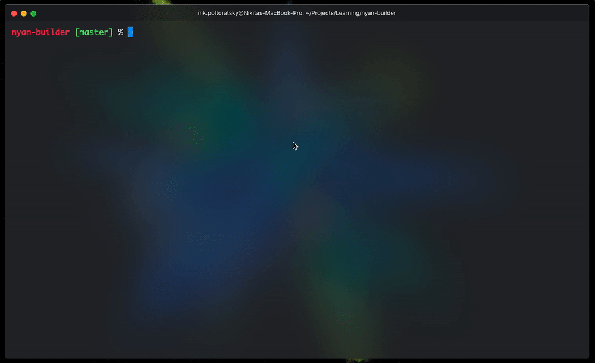

# Angular CLI Nyan Builder 👇



## Installation

- `npm i nyan-builder`
- Register builder itself:

  - Browser
```json
"projects": {
  ...
  "example-app": {
    ...
    "architect": {
      ...
      "build": {
        "builder": "nyan-builder:browser"
        "options": {
              ...
        }
```

  - Dev Server: 
```json
"projects": {
  ...
  "example-app": {
    ...
    "architect": {
      ...
      "build": {
        "builder": "nyan-builder:dev-server"
        "options": {
              ...
        }
```

  - Karma: 
```json
"projects": {
  ...
  "example-app": {
    ...
    "architect": {
      ...
      "build": {
        "builder": "nyan-builder:karma"
        "options": {
              ...
        }
```

  - Server: 
```json
"projects": {
  ...
  "example-app": {
    ...
    "architect": {
      ...
      "build": {
        "builder": "nyan-builder:server"
        "options": {
              ...
        }
```

  
## How can I support the developer?

- Create pull requests, submit bugs, suggest new features or documentation updates 🔧
- Star my [GitHub](http://github.com/tibing/) repos ⭐️
- Read me on [Medium](https://medium.com/@nik.poltoratsky) and [Dev.to](https://dev.to/nikpoltoratsky)
- Follow me on [Twitter](https://twitter.com/NikPoltoratsky) 🐾
